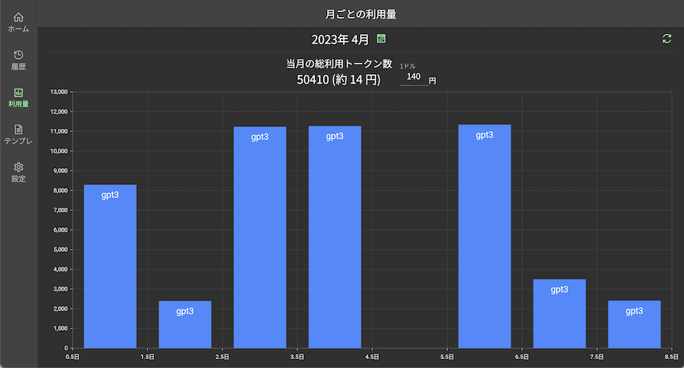

# assistant_me
ChatGPT APIを利用したアシスタントWebアプリです。  
公式UIが個人的に使いづらく自分用にカスタマイズしたかったのが作成動機です。  

本アプリは`Firebase Hosting`にデプロイする想定で作っています。  
`flutterfire`を使っていますので`main.dart`の`DefaultFirebaseOptions`は`flutterfire configure`で自動生成されます。  

また、APIKeyは永続領域には持たず、メモリに保持しているのでページをリロードしたり開き直すと再度設定が必要となります。  

# コマンド
```
// ビルド 自分用なのでweb-rendererは指定しません
flutter build web

// デプロイ
firebase deploy
```

# スクショ




# TODO
## 優先度高
1. トークン数がmax_tokensに達しても会話続行可能にする
   1. 勘違いしていて会話に反映できるのがMAX4096ってだけで別にそのまま会話は続けていい。
   2. ただプロンプトトークンからの差分になるので500くらいは常にあけておいた方が良いと思う。
2. 履歴の文字列検索機能
3. アシスタント側の会話内容にmarkdown使ってるからかコピペがクソ辛いのでなんか考える
4. 質問用のテンプレートをいくつか用意したい。真偽値パラメータ入れてみるとかCoTアプローチをする際のものとか。
## 優先度低
1. 履歴のタイトル編集（現在は最初の会話の先頭30文字）
2. 履歴でも会話を再開できるようにする
3. appSettingsクラスで持っているsystemの文言を設定ページで変更できるようにする
   1. →systemの設定内容はあまり効いてないので見直し
4. temperatureやpresence_penaltyなどのパラメータを設定できるようにする
   1. →デフォルトでも十分そうなので実装しても使わなさそう
5. アシスタントのMarkDownでコードのシンタックスハイライトを実装する
   1. →対応したいが難易度高い
6. Stream対応してみたい
   1. →今のところあまり不便ではないがやってみたい
