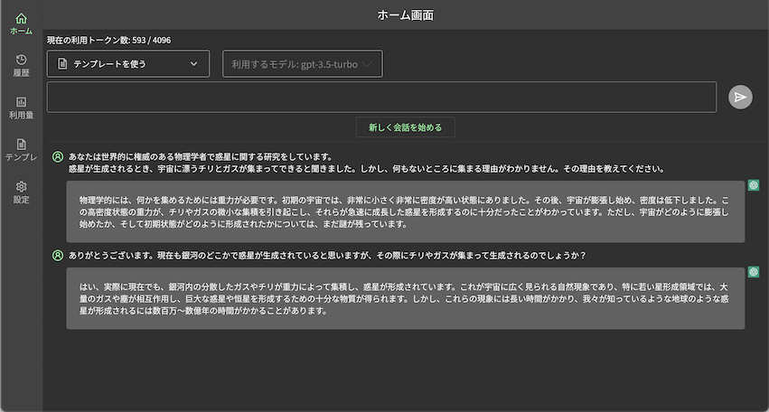
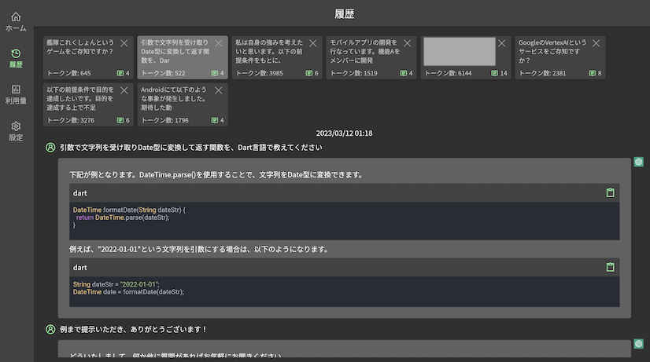
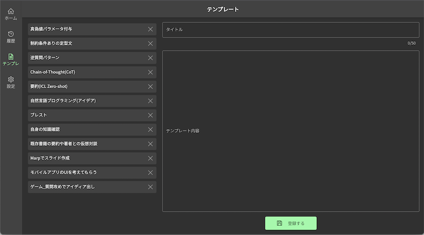

# assistant_me
OpenAI APIを利用したアシスタントWebアプリです。  
OSSでもWebUIは既に多く出ていますが、自分用に自由にカスタマイズしたりチャット形式のWebアプリを1度Flutterで作ってみたかったというのが作成動機です。  

リポジトリのコードそのままでは`main.dart`がビルドエラーになりますので下に記載している「必要なもの」をご確認ください。
また、`Riverpod`や`Hive`のGeneratorを使っているので初回は`build_runner`を実行してください。  

# 必要なもの
1. デプロイ先のWebホスティングサービス
2. OpenAI API Key

# デプロイ先のWebホスティングサービスについて
このリポジトリでは`Firebase Hosting`にデプロイする想定でファイルを管理しています。(Hostingである必要はありません)
`Firebase Hosting`を利用する場合、初回はFirebaseプロジェクトを用意し`flutterfire configure`を実行してHostingの設定をしてください。
`flutterfire`で設定完了すればlibディレクトリ直下に`firebase_options.dart`（`DefaultFirebaseOptions`クラス）が生成されビルドエラーが解消されます。  

# OpenAI API Key
`API Key`は永続領域ではなくメモリに保持しています。そのためページをリロードしたり開き直すと再度設定が必要となります。  

# コマンド
```
// ビルド
flutter build web

// デプロイ
firebase deploy
```

# 画面スクショ


