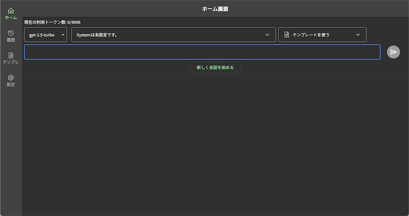
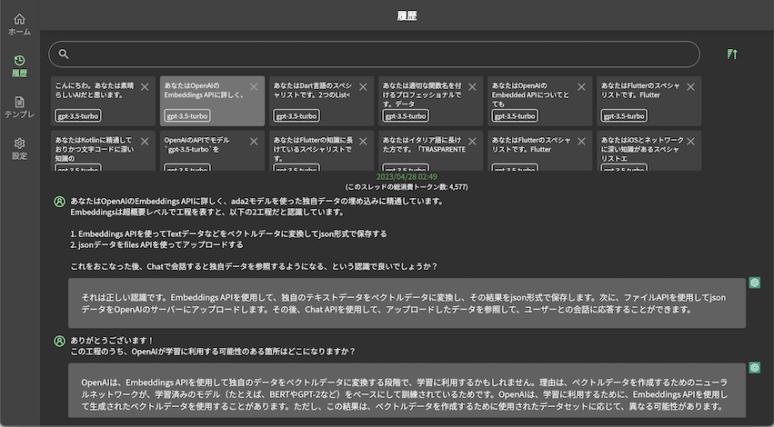

# assistant_me
ChatGPT APIを利用したアシスタントWebアプリです。  
公式UIが個人的に使いづらく自分用にカスタマイズしたかったのが作成動機です。  

本アプリは`Firebase Hosting`にデプロイする想定で作っています。  
`flutterfire`を使っていますので`main.dart`の`DefaultFirebaseOptions`は`flutterfire configure`で自動生成されます。  

また、APIKeyは永続領域には持たず、メモリに保持しているのでページをリロードしたり開き直すと再度設定が必要となります。  

# コマンド
```
// ビルド 自分用なのでweb-rendererは指定しません
flutter build web

// デプロイ
firebase deploy
```

# スクショ




# TODO
- 履歴画面
  - 履歴の検索機能 (優先度高)
  - スレッドのタイトル編集
  - 履歴でも会話を再開できるようにする（優先度低）
- 情報画面
  - appSettingsクラスで持っているsystemの文言を設定ページで変更できるようにする (優先度高)
    - →systemの設定内容はあまり効いてないので見直し
  - temperatureやpresence_penaltyなどのパラメータを設定できるようにする(デフォルトでも十分そう)
- 会話画面
  - トークン数が4096に達しても会話続行可能にする。ただそれ以降、会話継続に際して先頭から切っていく。かなり難しい
  - アシスタントのMarkDownでコードのシンタックスハイライトを実装する。かなり難しい
  - Stream対応するか？
